- [Introduction](#introduction)
- [The Christmas Pyramid](#the-christmas-pyramid)
- [Control Unit Design](#control-unit-design)
  - [Requirement Definition](#requirement-definition)
  - [System Architecture](#system-architecture)
  - [Over the Air Access](#over-the-air-access)
  - [Software Architecture](#software-architecture)
    - [Software Layer Stackup](#software-layer-stackup)
    - [Persistent Memory Scheme](#persistent-memory-scheme)
    - [Source Code Layout](#source-code-layout)
    - [Main Control Loop Flow](#main-control-loop-flow)
  - [Command Line Interface](#command-line-interface)
    - [Serial Interface Configuration](#serial-interface-configuration)
    - [Real-Time Clock / Temperature Format](#real-time-clock--temperature-format)
    - [Task List Format](#task-list-format)
    - [Command List](#command-list)

# Introduction
Some time ago, my dad called me to tell me that he is planing to build a giant christmas pyramid that is supposed to be placed in front of the local church at christmas time. The setting up should take place in the form of a Christmas party where everyone comes together and drinks mulled wine.

**What a great idea I thought!**

As the pyramid was to remain standing for the entire Christmas season, a control unit was needed for automatic operation.

# The Christmas Pyramid
As can be seen below, the pyramid contains a number of lamps (230 VAC) as well as a motor (230 VAC) for turning the wings.


# Control Unit Design
This section is going to describe the control unit design process.

## Requirement Definition
The ECU shall satisfy the following list of requirements:
- Shall have the ability to switch multiple 230 VAC actors (at least 2 individually)
- Shall have to ability to detect motion from humans that move in front of the pyramid
- Shall be able to play music
  - that is stored on an SD Card / USB thumb drive
  - that is in .mp3 and .wav format
  - that is automatically played based on motion sensor input
  - that is outputted through a standard 3.5mm audio jack to be fed to an audio amplifier
- shall have an interface to re-programmed the firmware image
- shall have the ability to be accessed over the air
- shall have the ability to setup tasks in which the user can specify
  - task activation/deactivation time
  - is music playback active/inactive
  - duration of music playback
  - is motion detection active/inactive
  - which AC-actor switch shall be active/inactive
- Shall operate within the temperature range of -20°C - 40°C


## System Architecture


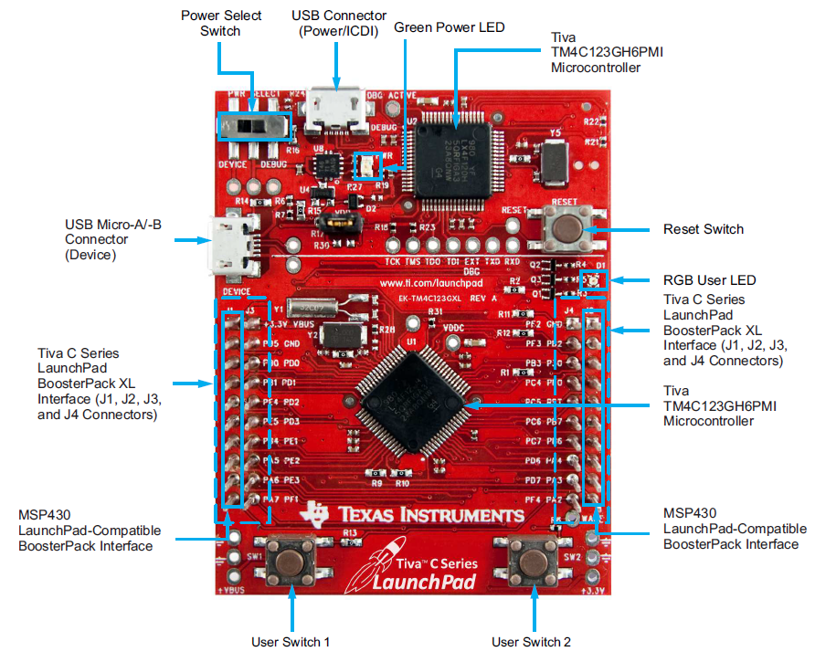


The system described here is a digital control system consisting of the following components

1. 80 MHz ARM Cortex-M4 µC TM4C123GH6PMI
1. Two-line dot-matrix display NHD-0216K3Z-NSW-BBW-V3
1. Endless rotary push encoder
1. UART-RF radio module HM-TRP
1. SD card interface 
1. USB 2.0 interface 
1. Sound card with VSI 003 audio codec
1. Real-time clock (incl. temperature sensor) DS3231
1. EEPROM 32KByte
1. 8-channel relay board (230VAC IOA)
1. Infrared motion sensor HCSR501

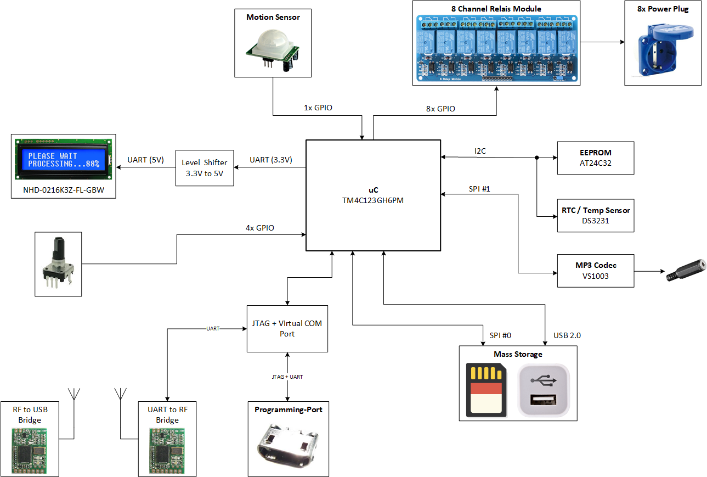

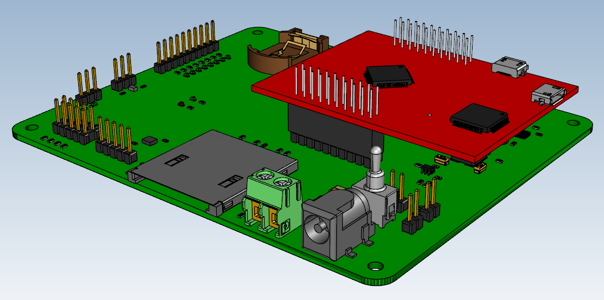


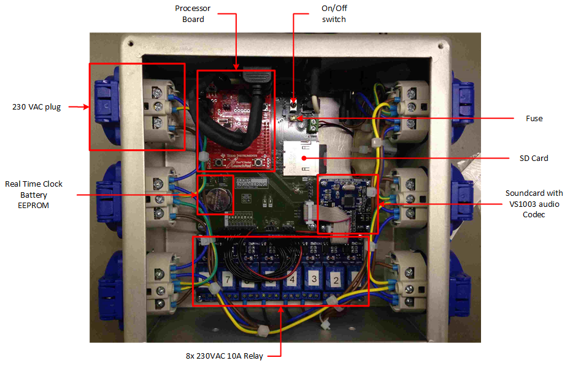
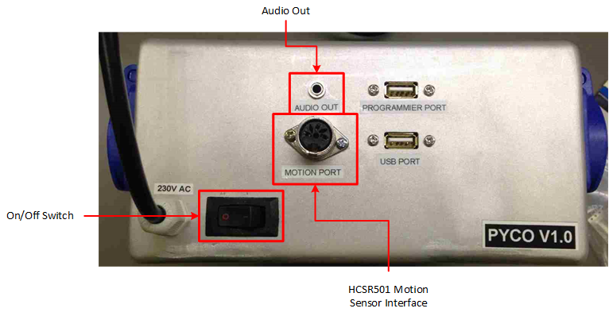

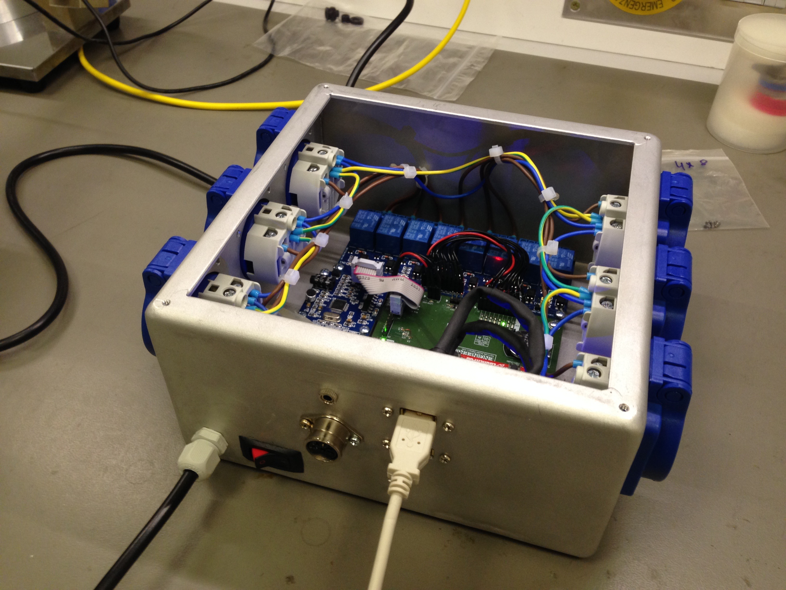
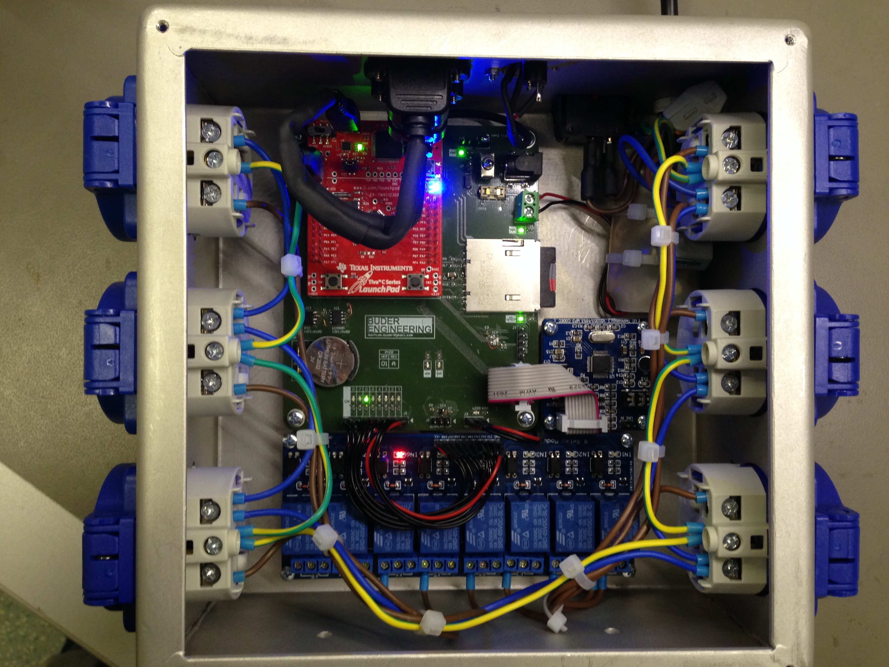

## Over the Air Access
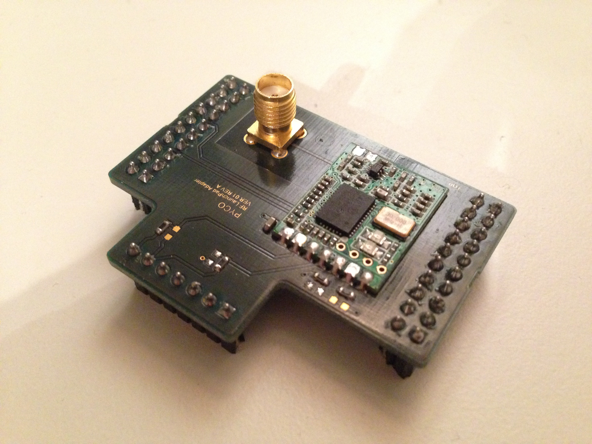
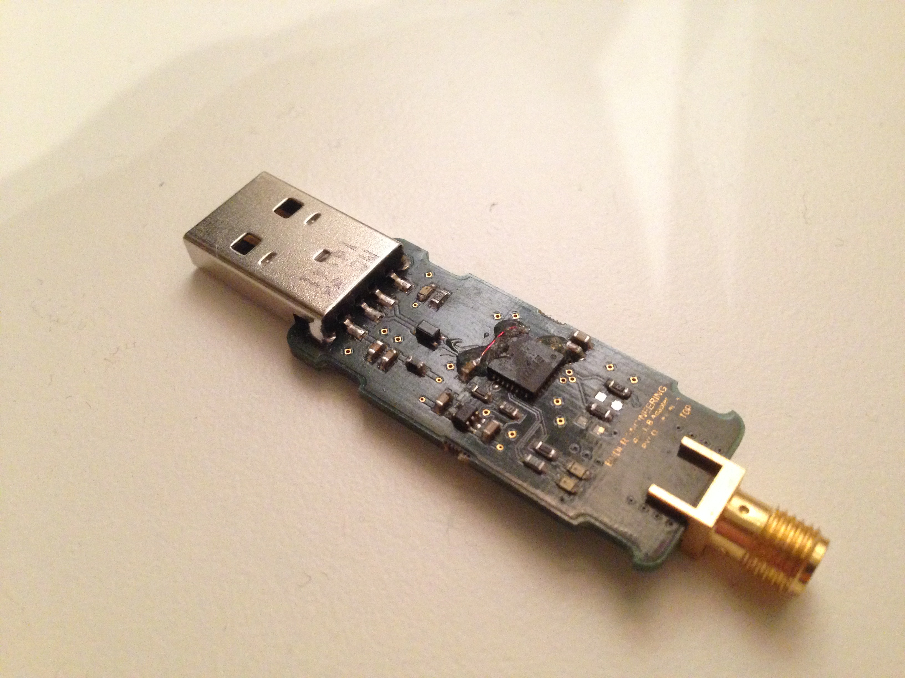

## Software Architecture

### Software Layer Stackup
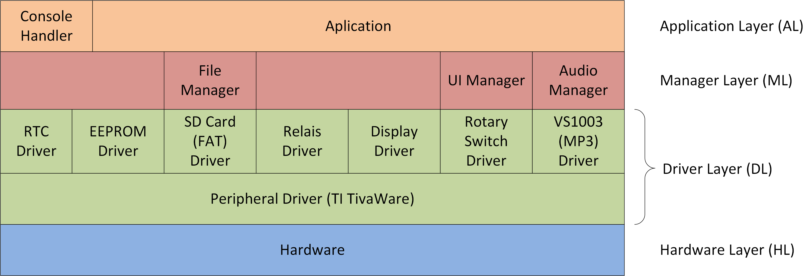


### Persistent Memory Scheme
All data that is required to be saved persistently is stored onto the SD card in the following two files:

* system.cfg
  
  Data is saved into an binary blob having the following format (specified in [System.h](software/System.h)):
  ```C
  typedef struct {
    uint8_t ui8Mode;                  // Switch between 0: Manuel, 1: Auto mode
    uint8_t ui8DefaultVolume;         // Default volume
    uint8_t ui8DefaultFadeTime;       // Default fade-in/out time (s)
    bool    bAutoSave;                // Enable/Disable auto-save-mode
    uint8_t ui8DefaultDsplContrast;   // Default display contrast
    uint8_t ui8DefaultDsplBrightness; // Default display brightness
    TIME    sDefaultActiveTime;       // Default active time
    uint8_t ui8DefaultMotionDelay;    // Default motion delay (s)
  }SYSTEM;
  ```

* task.cfg

  Data is saved into an binary blob having the following format [TaskManager.h](software/Manager/TaskManager.h)):
  ```C
  typedef struct {
    int16_t i16Id;                 // task id
    TIME    sStartTime;            // start time (hh:mm:ss)
    TIME    sStopTime;             // stop time (hh:mm:ss)
    TIME    sActiveTime;           // motion event aktive time (hh:mm:ss)
    bool    bMotion;               // motion active flag
    bool    bAudio;                // audio active flag
    bool    bActuator;             // actuator active flag
    bool    bActuatorCH[ACT_N_CH]; // active actuator channel no.
    uint8_t ui8ActuatorProg;       // actuator program (runns when actuators are activated)
  }TASK;
  ```

### Source Code Layout
- [Application](/software/main.c)
  - Global Initialization based on [System.c](/software/System.c)
  - [Main Control Loop](/images/MainControlLoop.png)
- [System Configuration](/software/System.c)
- [Manager](/software/Manager)
  - [Audio Manager](/software/Manager/AudioManager.c)
  - [Console Manager](/software/Manager/ConsoleManager.c)
  - [Display Manager](/software/Manager/DisplayManager.c)
  - [File Manager](/software/Manager/FileManager.c)
  - [Task Manager](/software/Manager/TaskManager.c)
- Utilities
  - [Command Line Handler](/software/utils/cmdline.c)
  - [UART stdio Interface Driver](/software/utils/uartstdio.c)
- Handy Macros
  - [stdio command line macros](/software/Msg.h)

### Main Control Loop Flow
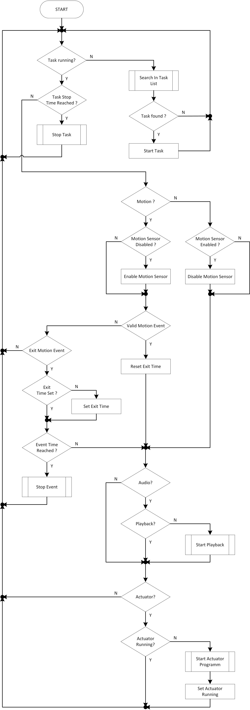

## Command Line Interface

The system configuration is done using the supplied USB wireless adapter. This, when used on a Windows system, emulates a serial interface (COM port) and can be used in conjunction with a console programme (Putty, hTerm, ...) to configure the system at hand. The following parameters shall be set for communication:

|        |      |
| ------- | ------ |
| Baudrate | 9600 |
| Databits | 8 |
| Stopbit | 1 |
| Parity | none |
| CTS| none |


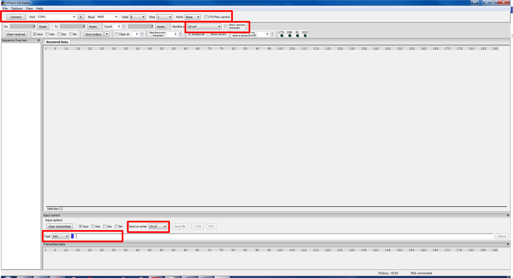

### Serial Interface Configuration


### Real-Time Clock / Temperature Format
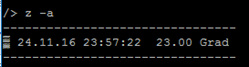

### Task List Format
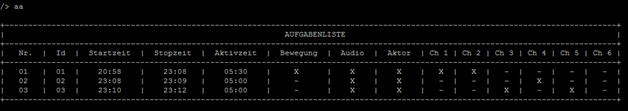

### Command List

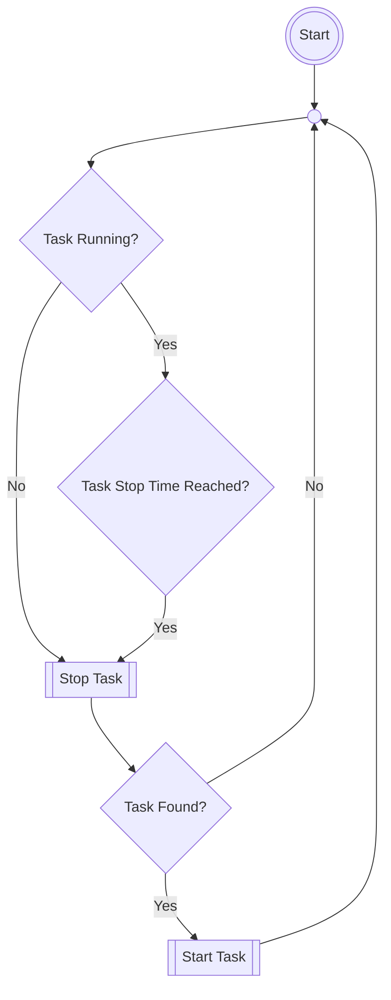