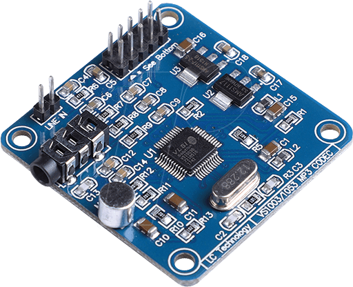
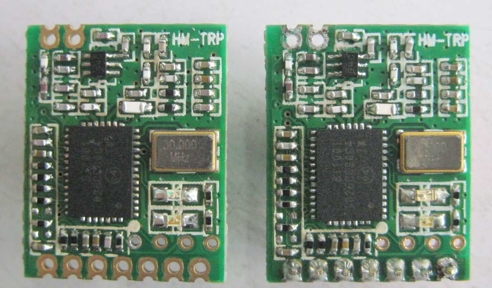

- [Introduction](#introduction)
- [The Christmas Pyramid](#the-christmas-pyramid)
- [Control Unit Design](#control-unit-design)
  - [Requirement Definition](#requirement-definition)
  - [System Architecture](#system-architecture)
    - [CPU Board](#cpu-board)
  - [Sound card](#sound-card)
  - [UART-RF Bridge](#uart-rf-bridge)
  - [Electronical Design](#electronical-design)
  - [Final Device Layout](#final-device-layout)
  - [Software Architecture](#software-architecture)
    - [Software Layer Stackup](#software-layer-stackup)
    - [Source Code Layout](#source-code-layout)
    - [Persistent Memory Scheme](#persistent-memory-scheme)
    - [Main Control Loop Flow](#main-control-loop-flow)
  - [Command Line Interface](#command-line-interface)
    - [Output Format](#output-format)
      - [Real-Time Clock / Temperature](#real-time-clock--temperature)
      - [Task List](#task-list)
    - [Command List](#command-list)

# Introduction
Some time ago, my dad called me to tell me that he is planing to build a giant christmas pyramid that is supposed to be placed in front of the local church at christmas time. The setting up should take place in the form of a Christmas party where everyone comes together and drinks mulled wine.

**What a great idea I thought!**

As the pyramid was to remain standing for the entire Christmas season, a control unit was needed for automatic operation.

# The Christmas Pyramid
As can be seen below, the pyramid contains a number of lamps (230 VAC) as well as a motor (230 VAC) for turning the wings.

<div style="text-align:center"></div>

# Control Unit Design
This section is going to describe the control unit design process.

## Requirement Definition
The ECU shall satisfy the following list of requirements:
- Shall have the ability to switch multiple 230 VAC actors (at least 2 individually)
- Shall have to ability to detect motion from humans that move in front of the pyramid
- Shall be able to play music
  - that is stored on an SD Card / USB thumb drive
  - that is in .mp3 and .wav format
  - that is automatically played based on motion sensor input
  - that is outputted through a standard 3.5mm audio jack to be fed to an audio amplifier
- shall have an interface to re-programmed the firmware image
- shall have the ability to be accessed over the air
- shall have the ability to setup tasks in which the user can specify
  - task activation/deactivation time
  - is music playback active/inactive
  - duration of music playback
  - is motion detection active/inactive
  - which AC-actor switch shall be active/inactive
- Shall operate within the temperature range of -20°C - 40°C


## System Architecture
The overall system architecture is shown in the block diagram below. The basic idea is to use as many off-the-shelf components as possible and interconnect them using a custom designed carrier board.

1. 80 MHz ARM Cortex-M4 µC TM4C123GH6PMI
2. Two-line dot-matrix display NHD-0216K3Z-NSW-BBW-V3
3. Endless rotary push encoder
4. UART-RF radio module HM-TRP
5. SD card interface 
6. USB 2.0 interface 
7. Sound card with VSI 003 audio codec
8. Real-time clock (incl. temperature sensor) DS3231
9. EEPROM 32KByte
10. 8-channel relay board (230VAC IOA)
11. Infrared motion sensor HCSR501

<div style="text-align:center"></div>

### CPU Board
As central processing unit the evaluation kit [EK-TM4C123GXL](https://www.ti.com/tool/EK-TM4C123GXL) from TI has been used. This board offers:

* 80 MHz ARM Cortex-M4 (TM4C123GH6PMI)
* On-Board ICD (JTAG) incl. an virtual serial port over a single USB connection
* USB 2.0 interface for e.g. mass-storage interface
* On-Board clocking incl. LFO for real-time clock applications
* Rich expansion header to interface with all available peripherals
* Rich, free and easy-to-use API provided by TI
* __Cost on 10 EUR__

<div style="text-align:center"></div>

## Sound card
To enable the device to play audio in .mp3 and .wav format the audio codec [VS1003 from VLSI solution](electronical%20design/components/02_Audio_Codec/VS1003.pdf) has been utilized. It connects to an MCU over an SPI interface and accepts a raw data stream of many codecs like MP3, WMA, RIFF WAV amd MIDI formats. In addition, it provides the capability to adjust the output volume by software which enables flexible audio fade-in/out.

<div style="text-align:center"></div>


## UART-RF Bridge
The system will be equipped with an software bootload that allows to update the software of the virtual serial port. As this update is required to be performed over the air the UART-to-RF bridge [HM-TRP](electronical%20design/components/09_RF/HM-TRP.pdf) has been utilized.

<div style="text-align:center"></div>

Two custom boards have been designed to allow the [HM-TRP](electronical%20design/components/09_RF/HM-TRP.pdf) to interface with thw MCUs virtual serial port and the remote computer.

<div style="text-align:center"></div>
<center>MCU ide RF adapter</center>
<div style="text-align:center"></div>
<center>Remote PC side RF adapter</center>


## Electronical Design
All schematics can be found within the [electronical design](electronical%20design/schematics/) folder.

* [Main Board](electronical%20design/schematics/main%20board/PYRAMIDE%20CONTROLLER.pdf)
* [UART to RF Bridge](electronical%20design/schematics/UART%20to%20RF%20Bridge/RfLauchPadAdapter.pdf)
* [USB to RF Bridge](electronical%20design/schematics/USB%20%20to%20RF%20Bridge/RfUsbAdapter.pdf)

The final result after the PCB schematics capture and layout phase can be seen below.

__Note: The RF-to-UART board isn't attached on these images. It would be stacked on top of the EK-TM4C123GXL evaluation kit.__

<div style="text-align:center"></div>


## Final Device Layout
The final result of the assembled device incl. its enclosure can be seen below.
<div style="text-align:center">


</div>


## Software Architecture

### Software Layer Stackup
The software has been broken into individual software components that where stacked onto each other and exchange data over a defined software interface.

<div style="text-align:center"></div>

### Source Code Layout
- [Application](/software/main.c)
  - Global Initialization based on [System.c](/software/System.c)
  - [Main Control Loop](/images/MainControlLoop.png)
- [System Configuration](/software/System.c)
- [Manager](/software/Manager)
  - [Audio Manager](/software/Manager/AudioManager.c)
  - [Console Manager](/software/Manager/ConsoleManager.c)
  - [Display Manager](/software/Manager/DisplayManager.c)
  - [File Manager](/software/Manager/FileManager.c)
  - [Task Manager](/software/Manager/TaskManager.c)
- Utilities
  - [Command Line Handler](/software/utils/cmdline.c)
  - [UART stdio Interface Driver](/software/utils/uartstdio.c)
- Handy Macros
  - [stdio command line macros](/software/Msg.h)

### Persistent Memory Scheme
All data that is required to be saved persistently is stored onto the SD card into the following two files:

* system.cfg
  
  Data is saved into an binary blob having the following format (specified in [System.h](software/System.h)):
  ```C
  typedef struct {
    uint8_t ui8Mode;                  // Switch between 0: Manuel, 1: Auto mode
    uint8_t ui8DefaultVolume;         // Default volume
    uint8_t ui8DefaultFadeTime;       // Default fade-in/out time (s)
    bool    bAutoSave;                // Enable/Disable auto-save-mode
    uint8_t ui8DefaultDsplContrast;   // Default display contrast
    uint8_t ui8DefaultDsplBrightness; // Default display brightness
    TIME    sDefaultActiveTime;       // Default active time
    uint8_t ui8DefaultMotionDelay;    // Default motion delay (s)
  }SYSTEM;
  ```

* task.cfg

  Data is saved into an binary blob having the following format [TaskManager.h](software/Manager/TaskManager.h)):
  ```C
  typedef struct {
    int16_t i16Id;                 // task id
    TIME    sStartTime;            // start time (hh:mm:ss)
    TIME    sStopTime;             // stop time (hh:mm:ss)
    TIME    sActiveTime;           // motion event aktive time (hh:mm:ss)
    bool    bMotion;               // motion active flag
    bool    bAudio;                // audio active flag
    bool    bActuator;             // actuator active flag
    bool    bActuatorCH[ACT_N_CH]; // active actuator channel no.
    uint8_t ui8ActuatorProg;       // actuator program (runns when actuators are activated)
  }TASK;
  ```

### Main Control Loop Flow
The software has been design in a way that all runs within a single runnable instance. To accomplish the parallel processing of the main control loop, the Audio and UART handling an interrupt mechanism is used.

<div style="text-align:center"></div>

## Command Line Interface

The system configuration is done over UART using the RF-to-USB adapter. This, when used on a Windows system, emulates a serial interface (COM port) and can be used in conjunction with a console programme (Putty, hTerm, ...) to configure the system at hand. The following parameters shall be set for communication:

|        |      |
| ------- | ------ |
| Baudrate | 9600 |
| Databits | 8 |
| Stopbit | 1 |
| Parity | none |
| CTS| none |

<div style="text-align:center"></div>

### Output Format

#### Real-Time Clock / Temperature
The output format of the RTC and temperature component can be seen below.

Date format : <Day of week> <Tag> <Monat> <Jahr>\
Time Foramt : <Stunde> <Minute> <Sekunde>\
Temperature Format : <##.##>


<div style="text-align:center"></div>

#### Task List
The output format of the task list can be seen below. Each task can be individually configured using the commands listed in section [Command List](#command-list) below.
<div style="text-align:center"></div>

### Command List
